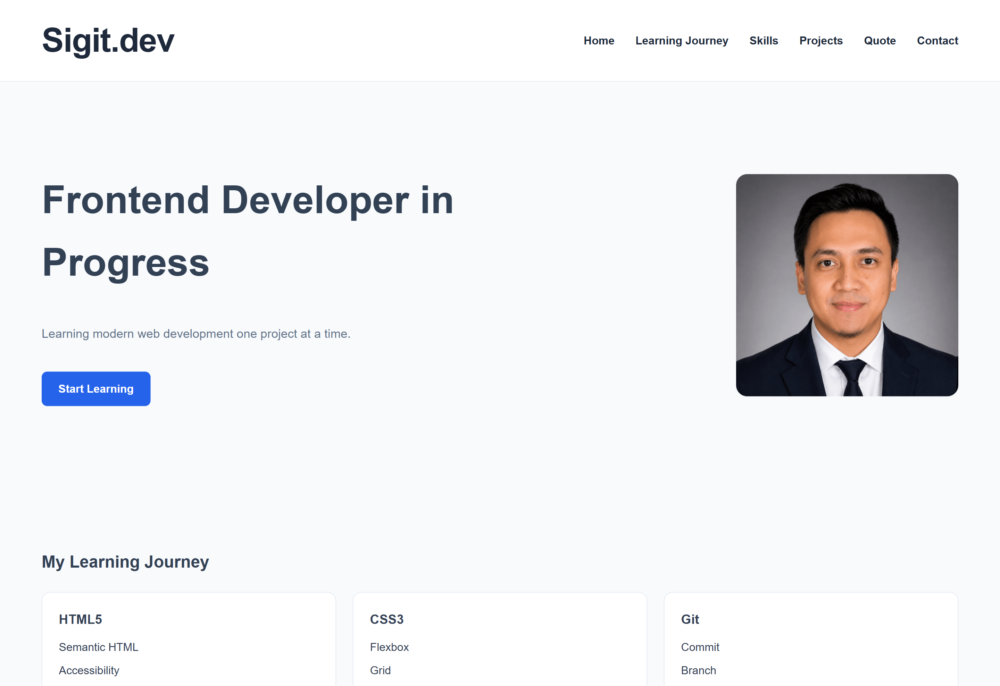
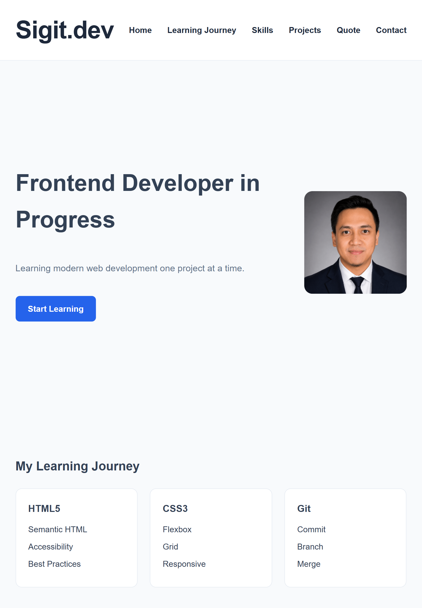

# Productive Weekend Landing Page

A responsive landing page built with HTML5, CSS3, Flexbox, CSS Grid, animations, and accessibility best practices as part of the WPH Frontend Bootcamp Week 2 assignment.

---

## Preview

### Desktop



### Tablet



### Mobile


---

## Features

- Semantic HTML5
- CSS Variables
- Flexbox Layout
- CSS Grid
- Responsive Design
- Hover Effects
- CSS Animations
- Accessibility Improvements
- Contact Section
- Animated Skill Progress Bars

---

## Technologies

- HTML5
- CSS3
- Git
- GitHub Pages

---

## Live Demo

👉 https://sigitsyambudi.github.io/wph-week2-productive-weekend-landing-page/

---

## Installation

```bash
git clone https://github.com/sigitsyambudi/wph-week2-productive-weekend-landing-page.git
```

```bash
cd wph-week2-productive-weekend-landing-page
```

Open `index.html` in your browser.

---

## Author

**Sigit Syambudi**

- GitHub: https://github.com/sigitsyambudi
- LinkedIn: https://www.linkedin.com/in/sigit-syambudi/
